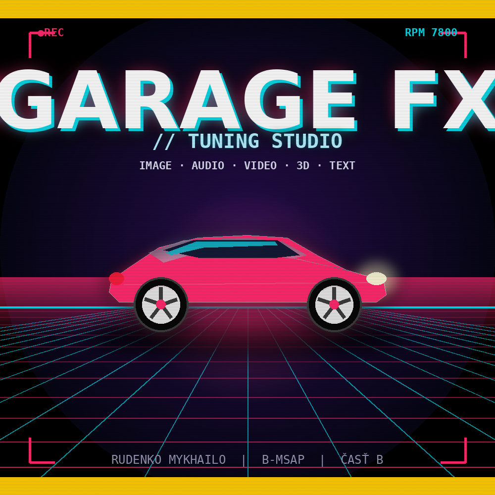

# GARAGE FX — Tuning Studio

> A client-side multimedia editor in the aesthetic of an underground tuning garage.
> Five bays · five media types · 60+ filters · zero backend.



```
  ╔══════════════════════════════════════════════════════╗
  ║   GARAGE FX // TUNING STUDIO                         ║
  ║   IMAGE · AUDIO · VIDEO · 3D · TEXT                  ║
  ║   100% client-side · WebGL / Web Audio / Canvas      ║
  ╚══════════════════════════════════════════════════════╝
```

---

## About

GARAGE FX is a single-page interactive web app — a multimedia editor styled as a
diagnostic dashboard in an underground tuning shop. Drop your media in, pick a
mod from the wall of filters, watch the preview rev up in real time, export the
build.

Five "bays" handle five media types, each with its own filter wall, sliders and
export pipeline. The 3D bay is a full NFSU2-style tuner: procedural sport coupe,
swappable parts, paint shop with five finishes, drag-to-orbit camera, live
horsepower stats.

Built as semester project for **B-MSAP, Časť B** at FIIT STU.

---

## Features

### IMAGE BAY — 19 filters

Chrome Shine · Carbon Fiber · Racing Stripes · Neon Underglow · JDM Poster ·
Initial D · Smoke Trail · Engine Bay · Polaroid · Night Tokyo · Tire Burn ·
Speed Lines · Holographic · Drift Smoke · Lens Dirt · Anamorphic Flare ·
Halftone · Glitch RGB · Vignette + Grain

Brightness / Contrast / Saturation / Hue / Blur / Exposure controls + PNG export.

### AUDIO BAY — 12 effects + RPM spectrum

Engine Rev · Exhaust Echo · Doppler · Tunnel Reverb · Sub Boost · Vinyl Lo-Fi ·
Drift Screech · Radio AM · Megaphone · Distortion · Phaser · 8D Pan

Full Web Audio API chain with gain, playback rate and FX intensity controls.
Live spectrum analyzer styled as an RPM gauge.

### VIDEO BAY — 10 filters

Speed Ramp · Motion Blur · Anamorphic · Forza Grade · F&F Tint · Police Strobe ·
VHS Dashcam · Slow-Mo · Heat Haze · Chromatic Aberration

Real-time `<video>` → Canvas frame processing.

### 3D BAY — full NFSU2-style tuner

Ten tabs of part-swap heaven, all rendered live in WebGL:

| Tab          | Options                                                                |
|--------------|------------------------------------------------------------------------|
| **Paint**    | 5 finishes (gloss / metallic / matte / chrome / pearl), 16 body colors, 4 stripe styles |
| **Wheels**   | 6 rim styles (5-spoke / mesh / deep-dish / split-6 / turbine / blade), 8 rim colors, tire size 15–22", camber to −15°, stretch |
| **Body Kit** | Stock / Sport / Aggressive / Wide-body, side skirts, front lip / splitter / canards |
| **Spoiler**  | 6 types (lip / ducktail / wing / GT / track), color, wing height       |
| **Hood**     | Stock / Scoop / Vented / Cowl / Carbon / Transparent (engine visible)  |
| **Windows**  | 6 tint colors, darkness 0–95%, reflectivity                             |
| **Neon**     | Off / Solid / Pulse / Rainbow / Strobe, 8 colors, intensity + spread   |
| **Suspension** | Ride height, front/rear drop, wheel poke + Slammed / Hellaflush / Raked / Track presets |
| **Scene**    | Garage / Showroom / Night Tokyo / Desert / Track / Cyber               |
| **Stats**    | Live calculated HP, Torque, Weight, Drag, 0-100, Stance, Grip, Style   |

**Drag the viewport to orbit. Scroll to zoom.** Randomize button rolls a full build.

### TEXT BAY — 5 styles

Neon Sign · Racing Typography · License Plate · Speedometer · ASCII Car

Live editing + speedometer animation mode.

### Boot & FX

- ECU-style boot sequence with rolling log and engine-rev sound effect
- Particle background that reacts to user activity
- Animated hazard stripes on top and bottom borders
- CRT scan-lines + vignette overlay
- Glitch transition between bays
- Garage door opening animation when entering the 3D bay
- Paint-sparkle burst when changing body color
- Synth-generated UI sounds on every click

---

## Quick Start

```bash
git clone <repo-url>
cd GARAGE_FX
# Open index.html — that's it.
```

No build step. No `npm install`. No server. Double-click `index.html` or open it
in any modern browser.

The 3D bay loads Three.js from a CDN on first use; everything else works fully
offline.

---

## File Structure

```
GARAGE_FX/
├── index.html       # everything in one file (HTML + CSS + JS)
├── thumbnail.png    # 1000×1000 project preview
└── README.md        # you are here
```

---

## Tech Stack

- **HTML5** + **CSS3** (no preprocessors)
- **Vanilla JS** (no frameworks)
- **Canvas 2D** — image filters, video frame-by-frame processing, audio spectrum
- **Web Audio API** — audio FX chain (delays, convolvers, biquads, wave shapers, LFOs)
- **WebGL** via **Three.js r128** (lazy-loaded from CDN for the 3D bay only)
- **Custom orbit camera** built from scratch in ~30 lines (no OrbitControls dep)

---

## Controls

| Where             | Action                                           |
|-------------------|--------------------------------------------------|
| Anywhere on boot  | Click to skip                                    |
| Main menu         | Click a bay tile to enter                        |
| Inside a bay      | `Esc` returns to menu                            |
| Back button       | `← Späť na portál` — returns to portal / menu    |
| 3D viewport       | **Drag** to orbit · **Scroll** to zoom            |

---

## Assignment Constraints (B-MSAP, Časť B)

This project follows the hard rules of the assignment:

- ✅ **Client-side only** — no Flask, Node, Express, or any backend
- ✅ **Works after `git clone` + open `index.html`** — no build step
- ✅ Allowed APIs only: HTML5, CSS3, Vanilla JS, Web Audio, WebGL, Canvas, Three.js (CDN)
- ✅ Single `index.html` + `thumbnail.png` (exactly 1000×1000)
- ✅ Back button to portal
- ✅ At least 10 filters per module — actually 10–19 per module + 5 in text bay
- ✅ Visible WOW effect immediately on load

---

## Author

**Rudenko Mykhailo** · B-MSAP · Časť B · 2026
Fakulta informatiky a informačných technológií STU

---

## License

This is a school project. Code is provided as-is for educational purposes.
The aesthetic is a love letter to *Need for Speed: Underground 2* and *Initial D*.

```
 ▓▓▓▓▓▓▓▓▓▓▓▓▓▓▓▓▓▓▓▓▓▓▓▓▓▓▓▓▓▓▓▓▓▓▓▓▓▓▓▓▓▓▓▓▓▓▓▓▓▓▓▓▓▓▓▓▓▓
 ▓                                                          ▓
 ▓   "It's not about how fast you can go.                   ▓
 ▓    It's about how loud your underglow is."               ▓
 ▓                                                          ▓
 ▓                          — every kid in 2004             ▓
 ▓                                                          ▓
 ▓▓▓▓▓▓▓▓▓▓▓▓▓▓▓▓▓▓▓▓▓▓▓▓▓▓▓▓▓▓▓▓▓▓▓▓▓▓▓▓▓▓▓▓▓▓▓▓▓▓▓▓▓▓▓▓▓▓
```
